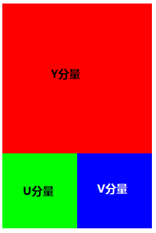
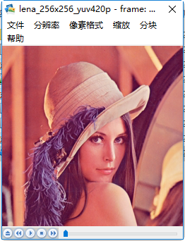
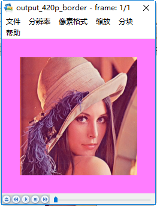
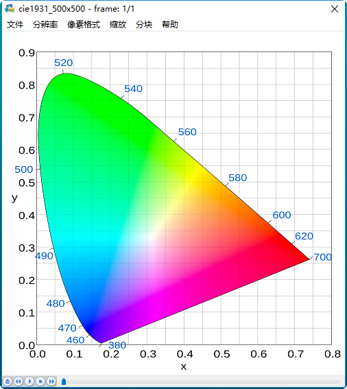
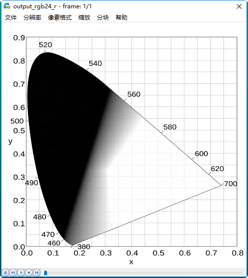
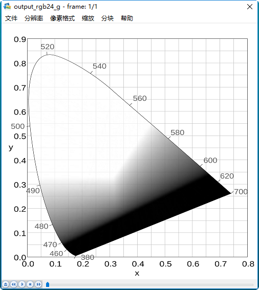
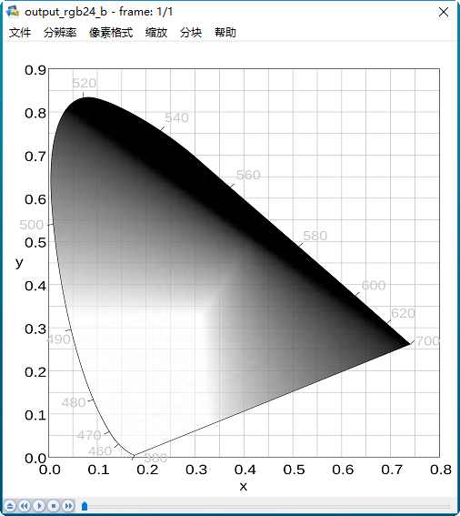
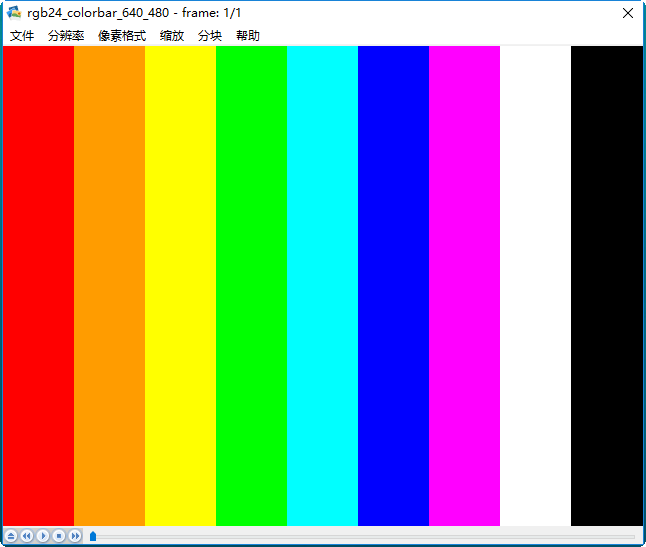
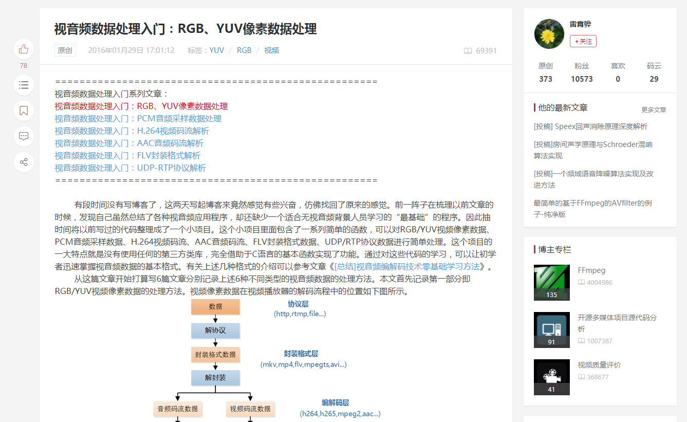

# 视音频数据处理入门

<br>
<br>


## 准备
yuv视频下载：
>http://trace.eas.asu.edu/yuv/ 

yuv播放器：[修改了一个YUV/RGB播放器](http://blog.csdn.net/leixiaohua1020/article/details/50466201)

>注意：<br />
>本文中像素的采样位数一律为8bit。由于1Byte=8bit，所以一个像素的一个分量的采样值占用1Byte。<br />
>输出的U、V分量在YUV播放器中也是当做Y分量进行播放的。<br />


<br>
<br>


## 分离YUV420P像素数据中的Y、U、V分量
> 如果视频帧的宽和高分别为w和h，那么一帧YUV420P像素数据一共占用w*h*3/2 Byte的数据。其中前w * h Byte存储Y，接着的w * h * 1/4 Byte存储U，最后w * h * 1/4 Byte存储V。

yuv420p像素数据排列如下图。原图像分辨率为256 * 256，所以Y分量分辨率为256 * 256，U分量分辨率为128 * 128，V分量分辨率为128 * 128： 



yuv420_split.cpp 程序中的函数可以将YUV420P数据中的Y、U、V三个分量分离开来并保存成三个文件。


调用方法：
> ./yuv420_split  ./mediadata/lena_256x256_yuv420p.yuv 256 256


上述代码运行后，将会把一张分辨率为256x256的名称为lena_256x256_yuv420p.yuv的YUV420P格式的像素数据文件分离成为三个文件：

- output_420_y.y：纯Y数据，分辨率为**256x256**。注意播放时设置播放器分辨率。
- output_420_u.y：纯U数据，分辨率为**128x128**。注意播放时设置播放器分辨率。
- output_420_v.y：纯V数据，分辨率为**128x128**。注意播放时设置播放器分辨率。


<br />
<br />


## 分离YUV444P像素数据中的Y、U、V分量
> 说明：如果视频帧的宽和高分别为w和h，那么一帧YUV444P像素数据一共占用w * h * 3 Byte的数据。其中前w * h Byte存储Y，接着的w * h Byte存储U，最后w * h Byte存储V。

调用方法：
> ./yuv444p_split ./mediadata/lena_256x256_yuv444p.yuv 256 256

上述代码运行后，将会把一张分辨率为256x256的名称为lena_256x256_yuv444p.yuv的YUV444P格式的像素数据文件分离成为三个文件：

- output_444_y.y：纯Y数据，分辨率为**256x256**。
- output_444_u.y：纯U数据，分辨率为**256x256**。
- output_444_v.y：纯V数据，分辨率为**256x256**。


<br />
<br />


## 分离YUV422P像素数据中的Y、U、V分量（还有问题，图像显示不完整）
> 说明：对于YUV422P的格式，表示平面格式(Planar)，即Y、U、V是分开存储的，每个分量占一块地方，其中Y为width * height，而U、V合占width * height。根据U、V的顺序，分出2种格式，U前V后即YUV422P，也叫I422，V前U后，叫YV16(YV表示Y后面跟着V，16表示16bit)。

调用方法：
> ./yuv422p_split ./mediadata/lena_256x256_yuv422p.yuv 256 256

上述代码运行后，将会把一张分辨率为256x256的名称为lena_256x256_yuv422p.yuv的YUV422P格式的像素数据文件分离成为三个文件：

- output_422p_y.y：纯Y数据，分辨率为**256x256**。
- output_422p_u.y：纯U数据，分辨率为**128x128**。
- output_422p_v.y：纯V数据，分辨率为**128x128**。


<br />
<br />


## 将YUV420P像素数据去掉颜色（变成灰度图）
>说明：如果想把YUV格式像素数据变成灰度图像，只需要将U、V分量设置成128即可。这是因为U、V是图像中的经过偏置处理的色度分量。色度分量在偏置处理前的取值范围是-128至127，这时候的无色对应的是“0”值。经过偏置后色度分量取值变成了0至255，因而此时的无色对应的就是128了。

调用方法：
> ./yuv420p_gray ./mediadata/lena_256x256_yuv420p.yuv 256 256

上述代码运行后，将会把一张分辨率为256x256的名称为lena_256x256_yuv420p.yuv的YUV420P格式的像素数据文件处理成名称为output_420p_gray.yuv的YUV420P格式的像素数据文件。


<br />
<br />


## 将YUV420P像素数据的周围加上边框
> 说明：本程序将距离图像边缘border范围内的像素的Y分量、U分量、Y分量的取值设置成了最大值255。

调用方法：
> ./yuv420p_border ./mediadata/lena_256x256_yuv420p.yuv 256 256 30

上述代码运行后，将会把一张分辨率为256x256的名称为lena_256x256_yuv420p.yuv的YUV420P格式的像素数据文件处理成名称为output_420p_border.yuv的YUV420P格式的像素数据文件。输入的原图如下所示。

   


<br />
<br />


## 将YUV420P像素数据的亮度减半
>说明：如果打算将图像的亮度减半，只要将图像的每个像素的Y值取出来分别进行除以2的工作就可以了。图像的每个Y值占用1 Byte，取值范围是0至255，对应C语言中的unsigned char数据类型。

调用方法：
> ./yuv420p_half_y ./mediadata/lena_256x256_yuv420p.yuv 256 256

上述代码运行后，将会把一张分辨率为256x256的名称为lena_256x256_yuv420p.yuv的YUV420P格式的像素数据文件处理成名称为output_420p_half_y.yuv的YUV420P格式的像素数据文件。


<br />
<br />


## 分离RGB24像素数据中的R、G、B分量
> 说明：与YUV420P三个分量分开存储不同，RGB24格式的每个像素的三个分量是连续存储的。一帧宽高分别为w、h的RGB24图像一共占用w * h * 3 Byte的存储空间。RGB24格式规定首先存储第一个像素的R、G、B，然后存储第二个像素的R、G、B…以此类推。类似于YUV420P的存储方式称为Planar方式，而类似于RGB24的存储方式称为Packed方式。

调用方法：
> ./rgb24_split ./mediadata/cie1931_500x500.rgb 500 500

上述代码运行后，将会把一张分辨率为500x500的名称为cie1931_500x500.rgb的RGB24格式的像素数据文件分离成为三个文件：

- output_r.y：R数据，分辨率为**500x500**。
- output_g.y：G数据，分辨率为**500x500**。
- output_b.y：B数据，分辨率为**500x500**。

输入的原图是一张标准的CIE 1931色度图。该色度图右下为红色，上方为绿色，左下为蓝色，如下图所示：

 

R数据图像如图所示： 

G数据图像如图所示： 

B数据图像如图所示： 


<br />
<br />


## 将RGB24格式像素数据封装为BMP图像
>说明：BMP图像内部实际上存储的就是RGB数据。本程序实现了对RGB像素数据的封装处理。通过本程序中的函数，可以将RGB数据封装成为一张BMP图像。


调用方法：
>./rgb24_to_bmp ./mediadata/lena_256x256_rgb24.rgb 256 256


该程序完成了主要完成了两个工作：

- 将RGB数据前面加上文件头。
- 将RGB数据中每个像素的“B”和“R”的位置互换。

BMP文件是由BITMAPFILEHEADER、BITMAPINFOHEADER、RGB像素数据共3个部分构成

	//位图文件头结构体
	//这个结构体的长度是固定的14个字节。
	//考虑到结构体的字节对齐，将bfType单独提取出来，否则会造成该结构体为16个字节。
	static unsigned short bfType = 0x4D42;//指定文件类型，必须是0x424D，
	                                      //即字符串“BM”，也就是说所有.bmp文件的头两个字节都是“BM”。
	                                      //'BM'表示这是Windows支持的位图格式。
	typedef struct {
	    unsigned int bfSize;         //指定文件大小，以字节为单位，包括这14个字节。
	    unsigned short bfReserved1;  //为保留字，不用考虑
	    unsigned short bfReserved2;  //为保留字，不用考虑
	    unsigned int bfOffBits;      //位图文件头到数据的偏移量，以字节为单位  
	}BITMAPFILEHEADER;

	
	//位图信息头结构体
	typedef struct {
	    unsigned int biSize;          //该结构大小，字节为单位，一般为40个字节 
	    unsigned int biWidth;         //指定图象的宽度，单位是象素。
	    unsigned int biHeight;        //指定图象的高度，单位是象素。
	                                  //注：这个值除了用于描述图像的高度之外，它还有另一个用处，
	                                  //就是指明该图像是倒向的位图，还是正向的位图。
	                                  //如果该值是一个正数，说明图像是倒向的，如果该值是个负数，则说明图像是正向的。
	                                  //大多数的BMP文件都是倒向的位图，也就是高度值是一个正数。
	    unsigned short biPlanes;      //为目标设备说明颜色平面数，必须为1，不用考虑
	    unsigned short biBitCount;    //颜色深度，每个象素所需要的位数
	    unsigned int biCompression;   //位图的压缩类型 
	    unsigned int biSizeImage;     //位图的大小，以字节为单位
	    unsigned int biXPelsPerMeter; //位图水平分辨率，每米像素数
	    unsigned int biYPelsPerMeter; //位图垂直分辨率，每米像素数  
	    unsigned int biClrUsed;       //位图实际使用的颜色表中的颜色数  
	    unsigned int biClrImportant;  //位图显示过程中重要的颜色数  
	}BITMAPINFOHEADER;


BMP采用的是小端（Little Endian）存储方式。这种存储方式中“RGB24”格式的像素的分量存储的先后顺序为B、G、R。由于RGB24格式存储的顺序是R、G、B，所以需要将“R”和“B”顺序作一个调换再进行存储。

> 注意：vs中结构体默认是1个字节对齐，即为8的倍数。gcc中结构体默认是4个字节对齐，即为32的倍数。


<br />
<br />


## 将RGB24格式像素数据转换为YUV420P格式像素数据
>本程序实现了RGB到YUV的转换公式：
>
- Y =  0.299 * R + 0.587 * G + 0.114 * B
- U = -0.147 * R - 0.289 * G + 0.463 * B
- V =  0.615 * R - 0.515 * G - 0.100 * B

调用方法：
> ./rgb24_to_yuv420p ./mediadata/lena_256x256_rgb24.rgb 256 256


<br>

注意：
> 
- 1) RGB24存储方式是Packed，YUV420P存储方式是Planar。
- 2) U，V在水平和垂直方向的取样数是Y的一半


<br />
<br />


## 生成RGB24格式的彩条测试图

> rgb24_colorbar.cpp程序输出“红橙黄绿青蓝紫白黑”9种颜色的彩条。

输出结果如图所示：



<br />
<br />


## H.264视频码流解析
H.264原始码流（又称为“裸流”）是由一个一个的NALU组成的。

其中每个NALU之间通过startcode（起始码）进行分隔。

起始码分成两种：0x000001（3Byte）或者0x00000001（4Byte）。

如果NALU对应的Slice为一帧的开始就用0x00000001，否则就用0x000001。

H.264码流解析的步骤:
> 首先从码流中搜索0x000001和0x00000001，分离出NALU；
> 然后再分析NALU的各个字段。

NALU头结构：NALU类型(5bit)、重要性指示位(2bit)、禁止位(1bit)。 

>- NALU类型：1～12由H.264使用，24～31由H.264以外的应用使用。 
>- 重要性指示：标志该NAL单元用于重建时的重要性，值越大，越重要。(Nal_ref_idc：表示NAL的优先级。0～3，取值越大，表示当前NAL越重要，需要优先受到保护。如果当前NAL是属于参考帧的片，或是序列参数集，或是图像参数集这些重要的单位时，本句法元素必需大于0。)
>- 禁止位：网络发现NAL单元有比特错误时可设置该比特为1，以便接收方丢掉该单元。 


<br />
<br />


## 分离PCM16LE双声道音频采样数据的左声道和右声道
> 注：本文中声音样值的采样频率一律是44100Hz，采样格式一律为16LE。“16”代表采样位数是16bit。由于1Byte=8bit，所以一个声道的一个采样值占用2Byte。“LE”代表Little Endian，代表2 Byte采样值的存储方式为高位存在高地址中。

``` C++
//
//本程序中的函数可以将PCM16LE双声道数据中左声道和右声道的数据分离成两个文件。
//

#include <stdio.h>
#include <stdlib.h>
#include <string.h>

int pcm16le_split(const char *file)
{
    if (file == NULL) {
        printf("文件路径为空！\n");
        return 0;
    }
    
    FILE *fp = fopen(file, "rb+");
    if (fp == NULL) {
        printf("文件打开失败！\n");
        return 0;
    }
    
    FILE *fp_l = fopen("./output/output_l.pcm", "wb+");
    if (fp_l == NULL) {
        printf("左声道文件打开或创建失败！\n");
        return 0;
    }
    
    FILE *fp_r = fopen("./output/output_r.pcm", "wb+");
    if (fp_r == NULL) {
        printf("右声道文件打开或创建失败！\n");
        return 0;
    }
    
    unsigned char buf[4] = {0};
    
    //PCM16LE双声道数据中左声道和右声道的采样值是间隔存储的。
    //每个采样值占用2Byte空间。
    while (!feof(fp)) {
        fread(buf, 1, 4, fp);
        
        //保存左声道的数据，一个采样值16位，两个字节
        fwrite(buf, 1, 2, fp_l);
        
        //保存右声道的数据
        fwrite(buf+2, 1, 2, fp_r);
    }
    
    fclose(fp);
    fclose(fp_l);
    fclose(fp_r);
    
    return 1;
} 

int main()
{
    char file[] = "./mediadata/NocturneNo2inEflat_44.1k_s16le.pcm";
    if (pcm16le_split(file)) {
        printf("操作成功！！！\n");
    } else {
        printf("操作失败！！！\n");
    }
}

```

从代码可以看出，PCM16LE双声道数据中左声道和右声道的采样值是间隔存储的。每个采样值占用2Byte空间。代码运行后，会把NocturneNo2inEflat_44.1k_s16le.pcm的PCM16LE格式的数据分离为两个单声道数据：
output_l.pcm：左声道数据。
output_r.pcm：右声道数据。


<br />
<br />


## 将PCM16LE双声道音频采样数据中左声道的音量降一半
> 注：本文中声音样值的采样频率一律是44100Hz，采样格式一律为16LE。“16”代表采样位数是16bit。由于1Byte=8bit，所以一个声道的一个采样值占用2Byte。“LE”代表Little Endian，代表2 Byte采样值的存储方式为高位存在高地址中。

``` C++
//
//本程序中的函数可以将PCM16LE双声道数据中左声道的音量降低一半。
//

#include <stdio.h>
#include <stdlib.h>
#include <string.h>

int pcm16le_halfvolumeleft(const char *file)
{
    if (file == NULL) {
        printf("原始文件为空！\n");
        return 0;
    }
    
    FILE *fp = fopen(file, "rb+");
    if (fp == NULL) {
        printf("原始文件打开失败！\n");
        return 0;
    }
    
    FILE *fp1 = fopen("./output/output_halfleft.pcm", "wb+");
    if (fp1 == NULL) {
        printf("文件打开或创建失败！\n");
        return 0;
    }
    
    unsigned char buf[4] = {0};
    
    while(!feof(fp)) {
        //从文件中读取一次采样值，因为是16位的，所以需读取4个字节
        //左右声道采样值间隔存储
        //前两个字节为左声道采样值，后两个字节为右声道采样值
        fread(buf, 1, 4, fp);
        
        //将前两个字节(左声道采样值)强制转换为 short类型
        short *sample = (short *)buf;
        
        //将左声道采样值减半
        *sample = *sample / 2;
        
        //将减半的左声道采样值写入文件
        fwrite(sample, 1, 2, fp1);
        
        //将原始的右声道采样值写入文件
        fwrite(buf+2, 1, 2, fp1);
    }
    
    fclose(fp);
    fclose(fp1);
    
    return 1;
}

int main()
{
    char file[] = "./mediadata/NocturneNo2inEflat_44.1k_s16le.pcm";
    if (pcm16le_halfvolumeleft(file)) {
        printf("操作成功！！！\n");
    } else {
        printf("操作失败！！！\n");
    }
}
```

从源代码可以看出，本程序在读出左声道的2 Byte的取样值之后，将其当成了C语言中的一个short类型的变量。将该数值除以2之后写回到了PCM文件中。


<br />
<br />


## 将PCM16LE双声道音频采样数据的声音速度提高一倍
> 注：本文中声音样值的采样频率一律是44100Hz，采样格式一律为16LE。“16”代表采样位数是16bit。由于1Byte=8bit，所以一个声道的一个采样值占用2Byte。“LE”代表Little Endian，代表2 Byte采样值的存储方式为高位存在高地址中。

``` C++
//
//本程序中的函数可以通过抽象的方式将PCM16LE双声道数据的速度提高一倍。
//

#include <stdio.h>
#include <stdlib.h>
#include <string.h>

int pcm16le_doublespeed(const char *file)
{
    if (file == NULL) {
        printf("原始PCM文件为空！\n");
        return 0;
    }
    
    FILE *fp = fopen(file, "rb+");
    if (fp == NULL) {
        printf("原始PCM文件打开失败！\n");
        return 0;
    }
    
    FILE *fp1 = fopen("./output/output_doublespeed.pcm", "wb+");
    if (fp1 == NULL) {
        printf("文件打开或创建失败！\n");
        return 0;
    }
    
    int count = 0; //采样计数
    unsigned char buf[4] = {0};
    
    while( !feof(fp) ) {
        //从文件中读取一次采样值，因为是16位的，所以需读取4个字节
        //左右声道采样值间隔存储
        //前两个字节为左声道采样值，后两个字节为右声道采样值
        fread(buf, 1, 4, fp);
        
        //只把偶数次采样值写入文件
        if (count%2 == 0) {
            //保存左声道的数据，一个采样值16位，两个字节
            fwrite(buf, 1, 2, fp1);
        
            //保存右声道的数据，一个采样值16位，两个字节
            fwrite(buf+2, 1, 2, fp1);
        }
        
        count++;
    }
    
    fclose(fp);
    fclose(fp1);
    
    return 1;
}


int main()
{
    char file[] = "./mediadata/NocturneNo2inEflat_44.1k_s16le.pcm";
    if (pcm16le_doublespeed(file)) {
        printf("操作成功！！！\n");
    } else {
        printf("操作失败！！！\n");
    }
}

```

从源代码可以看出，本程序只采样了每个声道偶数点的样值。处理完成后，原本22秒左右的音频变成了11秒左右。音频的播放速度提高了2倍，音频的音调也变高了很多。

<br />
<br />

## 将PCM16LE双声道音频采样数据转换为PCM8音频采样数据
> 注：本文中声音样值的采样频率一律是44100Hz，采样格式一律为16LE。“16”代表采样位数是16bit。由于1Byte=8bit，所以一个声道的一个采样值占用2Byte。“LE”代表Little Endian，代表2 Byte采样值的存储方式为高位存在高地址中。

``` C++
//
//本程序中的函数可以通过计算的方式将PCM16LE双声道数据16bit的采样位数转换为8bit。
//

#include <stdio.h>
#include <stdlib.h>
#include <string.h>


int pcm16le_to_pcm8(const char *file)
{
    if (file == NULL) {
        printf("原始PCM文件为空！\n");
        return 0;
    }
    
    FILE *fp = fopen(file, "rb+");
    if (fp == NULL) {
        printf("原始PCM文件打开失败！\n");
        return 0;
    }
    
    FILE *fp1 = fopen("./output/pcm16le_to_pcm8.pcm", "wb+");
    if (fp1 == NULL) {
        printf("文件打开或创建失败！\n");
        return 0;
    }
    
    unsigned char buf[4] = {0};
    
    while ( !feof(fp) ) {
        //从文件中读取一次采样值，因为是16位的，所以需读取4个字节
        //左右声道采样值间隔存储,前两个字节为左声道采样值，后两个字节为右声道采样值
        fread(buf, 1, 4, fp);
        
        //将前两个字节(左声道采样值)强制转换为 short类型，因为short类型长度为两个字节
        short *sample = (short *)buf;
        
        //右移8位，相当于除以256(2的8次方)
        //将pcm16(short类型)的值以256为除数取模，作为pcm8的采样值
        unsigned char pcm8 = (*sample) >> 8;
        
        //因为short类型的范围为-32768~32767，经过上一步获得的结果为-128~127
        //所以转成unsigned char需要加上128，unsigned char类型的范围为0~255
        pcm8 = pcm8 + 128;
        
        //写入左声道的采样值
        fwrite(&pcm8, 1, 1, fp1);
        
        //将前两个字节(右声道采样值)强制转换为 short类型
        sample = (short *)(buf + 2);
        
        pcm8 = (*sample) >> 8;
        
        //-128~127 => 0~128
        pcm8 = pcm8 + 128;
        
        //写入右声道的采样值
        fwrite(&pcm8, 1, 1, fp1);
    }
    
    fclose(fp);
    fclose(fp1);
    
    return 1;
}


int main()
{
    char file[] = "./mediadata/NocturneNo2inEflat_44.1k_s16le.pcm";
    if (pcm16le_to_pcm8(file)) {
        printf("操作成功！\n");
    } else {
        printf("操作失败！\n");
    }
    
    return 0;
}
```

PCM16LE格式的采样数据的取值范围是-32768到32767，而PCM8格式的采样数据的取值范围是0到255。所以PCM16LE转换到PCM8需要经过两个步骤：第一步是将-32768到32767的16bit有符号数值转换为-128到127的8bit有符号数值，第二步是将-128到127的8bit有符号数值转换为0到255的8bit无符号数值。在本程序中，16bit采样数据是通过short类型变量存储的，而8bit采样数据是通过unsigned char类型存储的。


<br />
<br />


<br />
<br />


参考：[视音频数据处理入门：RGB、YUV像素数据处理](http://blog.csdn.net/leixiaohua1020/article/details/50534150)

