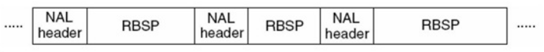
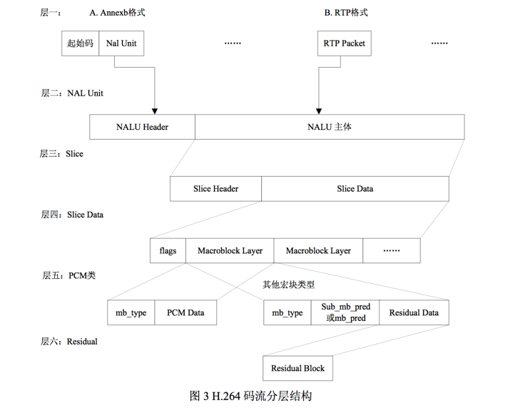
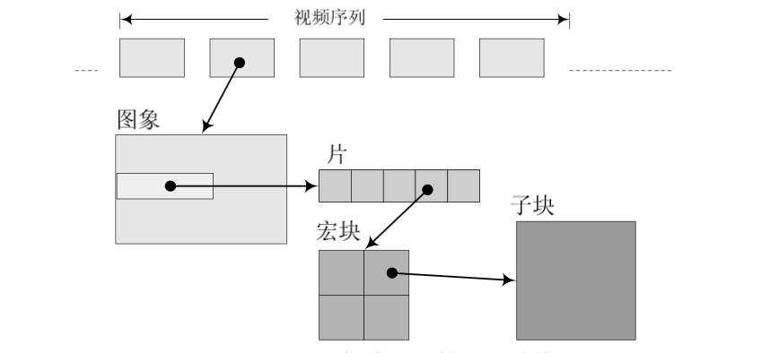
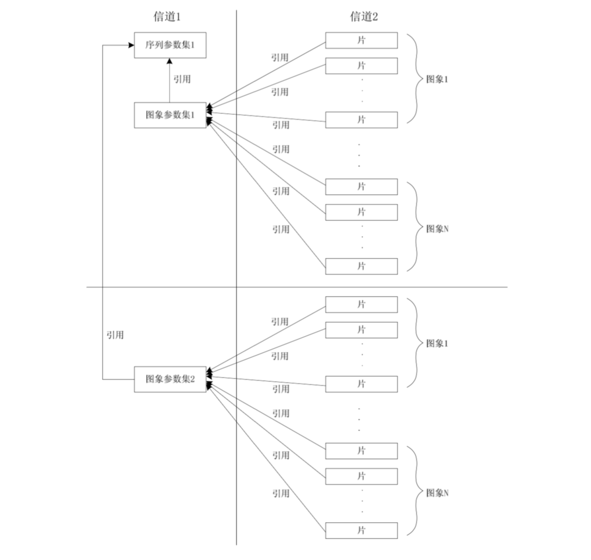
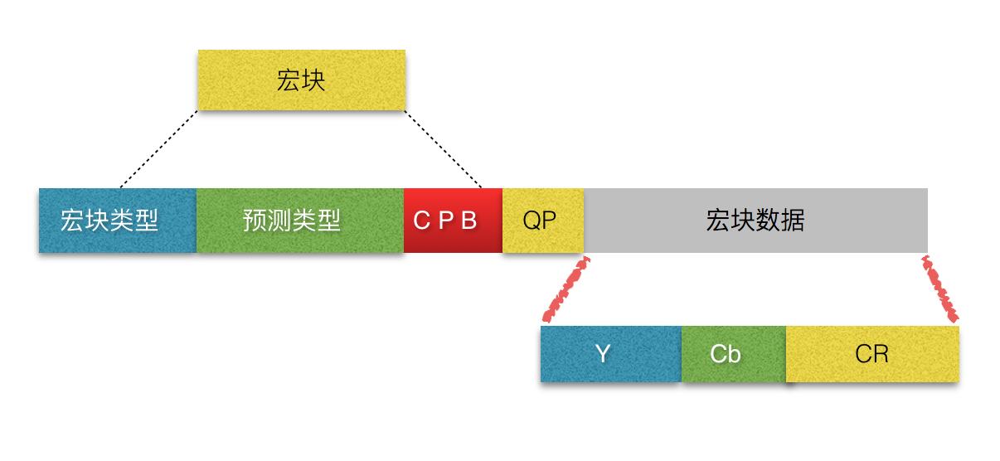
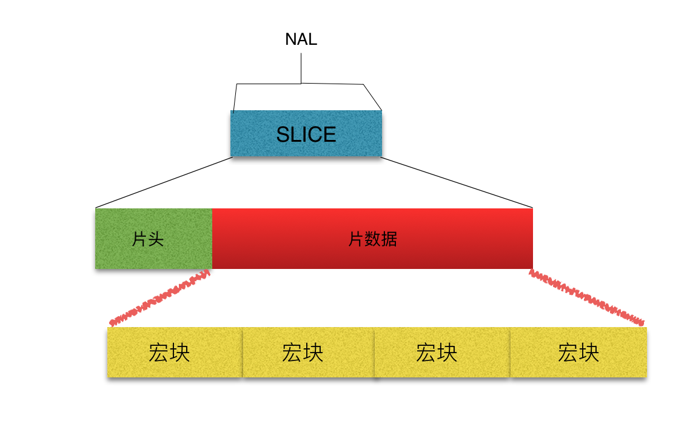
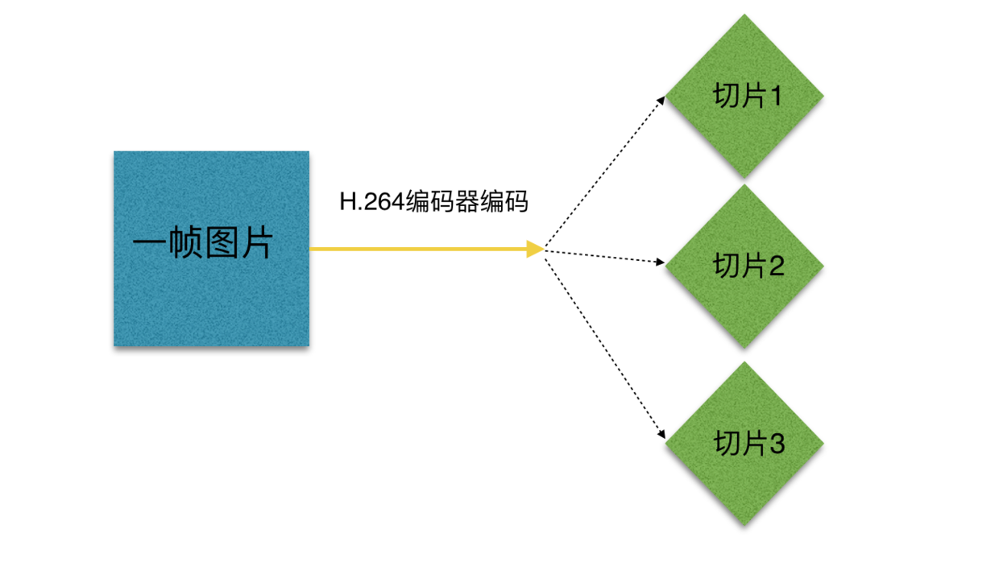
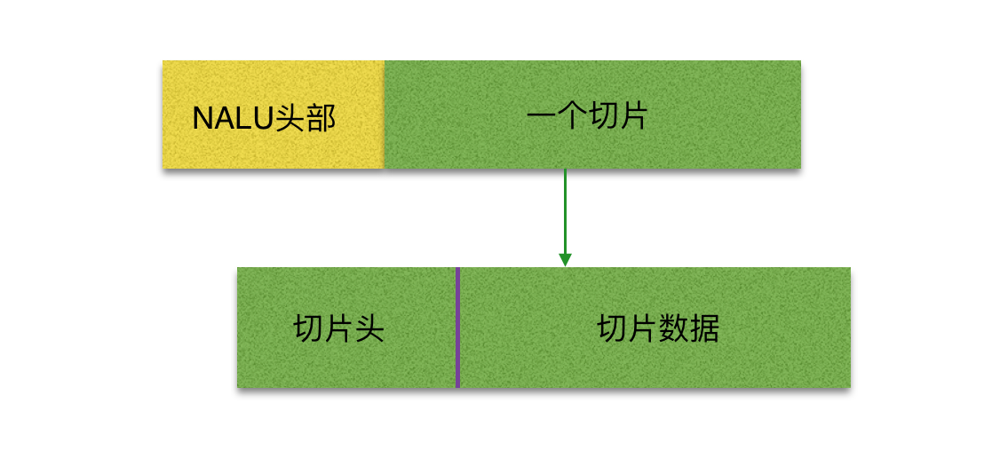

# NAL简介
> NAL全称Network Abstract Layer, 即网络抽象层。

在H.264/AVC视频编码标准中，整个系统框架被分为了两个层面：**视频编码层面（VCL, Video Coding Layer）和网络抽象层面（NAL, Network Abstraction Layer）。**其中，前者负责有效表示视频数据的内容，即编码处理的输出，它表示被压缩编码后的视频数据 序列。而后者则负责格式化数据并提供头信息，以保证数据适合各种信道和存储介质上的传输，即在 VCL 数据传输或存储之前，这些编码的 VCL 数据，先被映射或封装进 NAL 单元(以下简称 NALU，Nal Unit) 中。
因此我们平时的每帧数据就是一个NAL单元（SPS与PPS除外）。在实际的H264数据帧中，往往帧前面带有00 00 00 01 或 00 00 01分隔符，一般来说编码器编出的首帧数据为PPS与SPS，接着为I帧……

# H.264码流组成
H.264 原始码流(又称为裸流)，是由一个接一个的NAL单元组成，每个NAL单元包括：一组对应于视频编码数据的 NAL 头信息和一个原始字节序列负荷（RBSP, Raw Byte Sequence Payload）。而RBSP可能是SPS，PPS，IDR、Slice或SEI

上图中的 NALU头 + RBSP 就相当与一个 NALU (Nal Unit), 每个单元都按独立的 NALU 传送。 其实说白了，H.264 中的结构全部都是以 NALU 为主的，理解了 NALU，就理解 H.264 的结构了。

# NAL头部信息
> 起始码00 00 00 01(或00 00 01)的下一个字节就是NAL头部

 7                  | 6 5         | 4 3 2 1 0     
--------------------|-------------|---------------
 forbidden_zero_bit | nal_ref_idc | nal_unit_type 

forbidden_zero_bit(1 bit)：禁止位，值为1表示语法出错。在H.264规范中规定了这一位必须为0。
nal_ref_idc(2 bit)：参考级别。取0~3,似乎指示这个NALU的重要性,如00的NALU解码器可以丢弃它而不影响图像的回放,0～3，取值越大，表示当前NAL越重要，需要优先受到保护。如果当前NAL是属于参考帧的片，或是序列参数集，或是图像参数集这些重要的单位时，本句法元素必需大于0。
nal_unit_type(5 bit)：NAL单元类型。这个NALU单元的类型,1～12由H.264使用，24～31由H.264以外的应用使用。

# NAL单元类型
 NAL Type |                     Description                     | VCL
 ---------|-----------------------------------------------------|-----
 0        | 未规定                                               | N/A 
 1        | 非DIR图像中不采用数据划分的Slice。不分区、非IDR图像的片 | Yes 
 2        | 非DIR图像中A类数据划分Slice。片分区A                  | Yes 
 3        | 非DIR图像中B类数据划分Slice。片分区B                  | Yes 
 4        | 非DIR图像中C类数据划分Slice。片分区C                  | Yes 
 5        | DIR图像的Slice，Coded Video Sequence 的 Access Unit  | Yes
 6        | 补充增强信息（SEI）                                  | No
 7        | 序列参数集（SPS）                                    | No
 8        | 图像参数集（PPS）                                    | No
 9        | 分隔符（Access Unit Delimiter）                      | No
 10       | 序列结束符（End of Sequence）                         | No
 11       | 流结束符（End of Stream）                             | No
 12       | 填充数据（Filler）                                    | No
 13-23    | 保留                                                 | N/A
 24-31    | 未规定                                               | N/A

# NALU起始码
如果 NALU 对应的 Slice 为一帧的开始,则用 4 字节表示,即 0x00000001；否则用 3 字节表示,0x000001。

# H264码流分层结构

编码后视频的每一组图像（GOP，图像组）都给予了传输中的序列（PPS）和本身这个帧的图像参数（SPS），所以，我们的整体结构，应该如此：

GOP （图像组）主要用作形容一个 i 帧 到下一个 i 帧之间的间隔了多少个帧，增大图片组能有效的减少编码后的视频体积，但是也会降低视频质量，至于怎么取舍，得看需求了。

# SPS、PPS

用 NALU 作载体的还有 SEI、SPS、PPS 等等。

NAL_SPS = 7, // 序列参数集 （包括一个图像序列的所有信息，即两个 IDR 图像间的所有图像信息，如图像尺寸、视频格式等）。

NAL_PPS = 8, // 图像参数集 （包括一个图像的所有分片的所有相关信息， 包括图像类型、序列号等，解码时某些序列号的丢失可用来检验信息包的丢失与否）。

H.264 中，句法元素共被组织成 序列、图像、片、宏块、子宏块五个层次。

# 什么是宏块
> 宏块是视频信息的主要承载者，因为它包含着每一个像素的亮度和色度信息。视频解码最主要的工作则是提供高效的方式从码流中获得宏块中的像素阵列。
> 
组成部分：一个宏块由一个16×16亮度像素和附加的一个8×8 Cb和一个 8×8 Cr 彩色像素块组成。每个图象中，若干宏块被排列成片的形式。

宏块的结构图：

从上图中，可以看到，宏块中包含了宏块类型、预测类型、Coded Block Pattern、Quantization Parameter、像素的亮度和色度数据集等等信息。

# 什么是切片（slice）
> 片的主要作用是用作宏块（Macroblock）的载体。片之所以被创造出来，主要目的是为限制误码的扩散和传输。

> 如何限制误码的扩散和传输？每个片（slice）都应该是互相独立被传输的，某片的预测（片（slice）内预测和片（slice）间预测）不能以其它片中的宏块（Macroblock）为参考图像。

（slice）的具体结构：

我们可以理解为一 张/帧图片可以包含一个或多个分片(Slice)，而每一个分片(Slice)包含整数个宏块(Macroblock)，即每片（slice）至少一个 宏块(Macroblock)，最多时每片包含整个图像的宏块。

上图结构中，我们不难看出，每个分片也包含着头和数据两部分：
1、分片头中包含着分片类型、分片中的宏块类型、分片帧的数量、分片属于那个图像以及对应的帧的设置和参数等信息。
2、分片数据中则是宏块，这里就是我们要找的存储像素数据的地方。

# 一帧图片跟 NALU 的关联 

一帧图片经过 H.264 编码器之后，就被编码为一个或多个片（slice），而装载着这些片（slice）的载体，就是 NALU 了，我们可以来看看 NALU 跟片的关系（slice）。

 

片（slice）的概念不同与帧（frame），帧（frame）是用作描述一张图片的，一帧（frame）对应一张图片，而片（slice），是 H.264 中提出的新概念，是通过编码图片后切分通过高效的方式整合出来的概念，一张图片至少有一个或多个片（slice）。

上图中可以看出，片（slice）都是又 NALU 装载并进行网络传输的，但是这并不代表 NALU 内就一定是切片，这是充分不必要条件，因为 NALU 还有可能装载着其他用作描述视频的信息。

 
 

